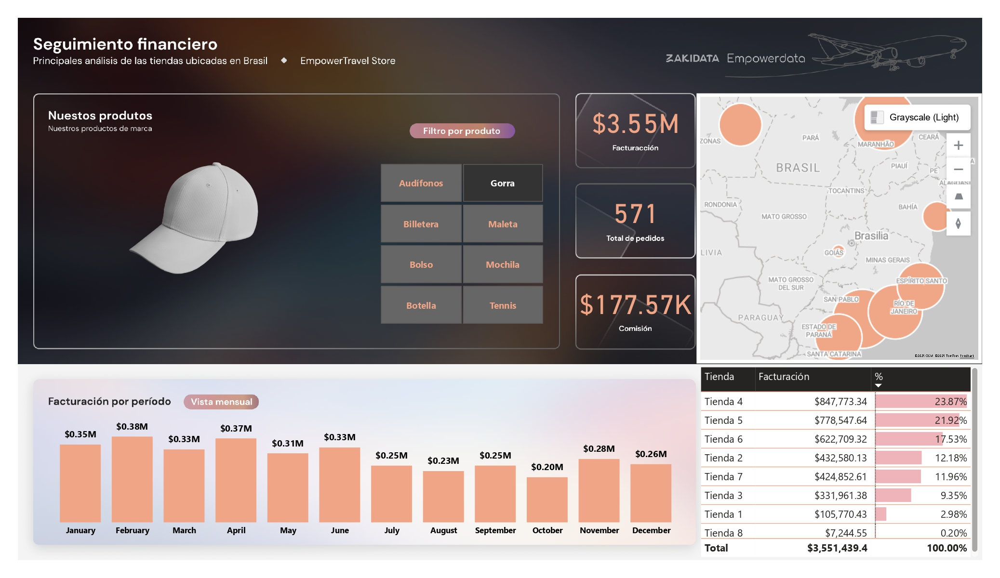

# 📊 Dashboard de Análisis de Ventas 2023

Este repositorio contiene un dashboard desarrollado en **Power BI** para analizar las ventas de una empresa en el año **2023**.  
El objetivo es ofrecer una visión clara del rendimiento general, identificar los productos más rentables, las tiendas con mayor facturación y las tendencias de crecimiento a lo largo del año.

---

## 📂 Contenido del repositorio
- `Dashboard_Ventas_2023.pbix` → archivo de Power BI.
- `bd_ventas_ESP.xlsx` → base de datos utilizada.
- Captura del dashboard (para vista previa sin abrir Power BI)

---

## 📈 Resumen de KPIs
- Facturación Total
- Total de Pedidos  
- Comisión Total  

---

## 🛒 Rendimiento por Producto y Tienda
### Productos más vendidos (por facturación):
- 🎒 Mochila 
- 👜 Bolso
- 💼 Maleta

### Tiendas con mayor facturación:
- 🏬 Tienda 5 (São Paulo)
- 🏬 Tienda 4 (São Luís)
- 🏬 Tienda 6 (Niterói) 

---

## 🖥️ Vista previa

---

## 🚀 Cómo usar este repositorio
1. Descarga el archivo `.pbix`.  
2. Abre el proyecto en **Power BI Desktop**.    

---

## 💡 Insights principales
- El **producto estrella** es la **Mochila**, con más del 47% de la facturación total.  
- Las **tiendas de São Paulo, São Luís y Niterói** concentran más del 75% de las ventas.   

---
